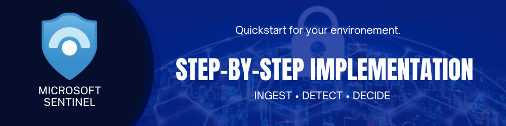
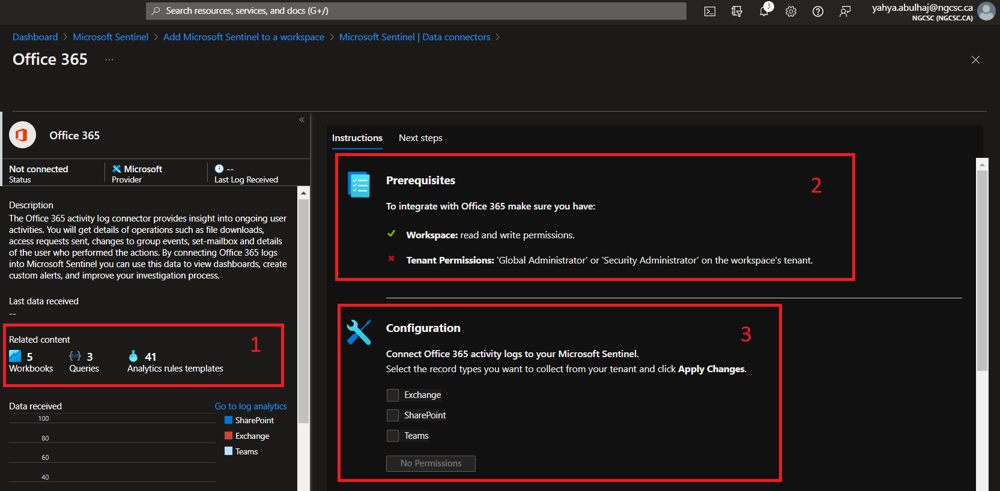
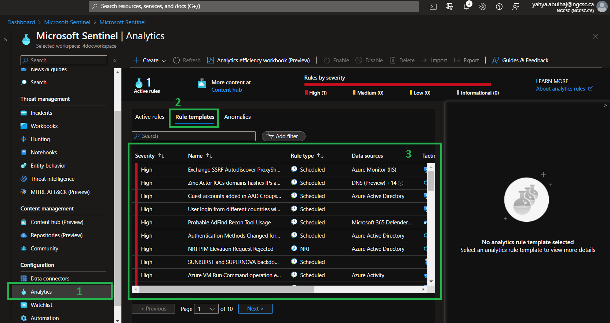
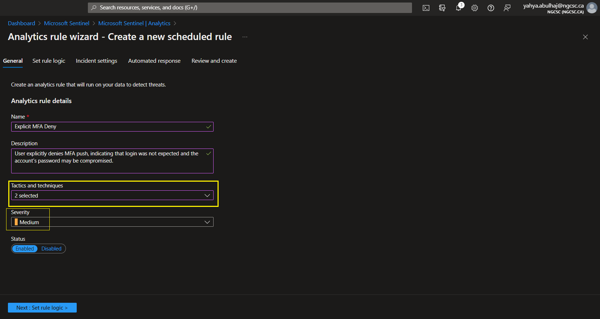

#  Sentinel Quickstart

I had a great time bringing value with Sentinel, and here I will try to assist you in getting started with integrating this product into your business. 
Sentinel, in my experience, is excellent for increasing your employees' overall awareness asides from assisting in decision making, providing advanced insights and protect your entreprise from threats.




#  Microsoft Sentinel Technical Procedure
## Description
This technical documentation will guide you through the  phase, which follows the installation of Sentinel and the workspace.

We'll go over some of the preliminary steps for configuring the product.

- Ingestion of the required **connectors**.
- Perform **analytics queries** to get alerted when threats appear.

# Connectors
The first step is to import the necessary connectors before running any queries on Sentinel.



<br>

**1-** The good news is once you connect some connectors. There will be analytics rules, workbooks as well as queries applied within the bundle.

**2-** To be configured, each connector will need its own prerequisite.


**3-** The same is true for the configuration. However, here you can find configurations that are as simple as clicking and others that necessitate the use of APIs.


# Analytics Rules

The Microsoft Team is attempting to include as many Analytics rule templates as possible. However, it is nearly impossible to cover everything, so you should be aware of how to include built-in queries as well as create your own with some knowledge of KQL.


Here i'll go through both cases.

## Built-In Rules

You can select the template provided within the product from the asset below, and it should become active in a matter of seconds.

Once in Sentinel, Click Analytics => Rules Templates.




## Custom Analytics Rules
We'll walk through configuring the yaml file below, which includes all of the pipeline's parameters. 

However, for this demonstration, we will conduct it as a security operation.

Here is the YAML for Explicit MFA Deny. 


```yml
id: a22740ec-fc1e-4c91-8de6-c29c6450ad00
name: Explicit MFA Deny
description: |
  'User explicitly denies MFA push, indicating that login was not expected and the account's password may be compromised.'
severity: Medium
requiredDataConnectors:
  - connectorId: AzureActiveDirectory
    dataTypes:
      - SigninLogs
  - connectorId: AzureActiveDirectory
    dataTypes:
      - AADNonInteractiveUserSignInLogs
queryFrequency: 1d
queryPeriod: 1d
triggerOperator: gt
triggerThreshold: 0
status: Available
tactics:
  - CredentialAccess
relevantTechniques:
  - T1110
query: |
  let aadFunc = (tableName:string){
  table(tableName)
  | where ResultType == 500121
  | where Status has "MFA Denied; user declined the authentication" or Status has "MFA denied; Phone App Reported Fraud"
  | extend Type = Type
  | extend timestamp = TimeGenerated, AccountCustomEntity = UserPrincipalName, IPCustomEntity = IPAddress, URLCustomEntity = ClientAppUsed
  };
  let aadSignin = aadFunc("SigninLogs");
  let aadNonInt = aadFunc("AADNonInteractiveUserSignInLogs");
  union isfuzzy=true aadSignin, aadNonInt
entityMappings:
  - entityType: Account
    fieldMappings:
      - identifier: FullName
        columnName: AccountCustomEntity
  - entityType: IP
    fieldMappings:
      - identifier: Address
        columnName: IPCustomEntity
  - entityType: URL
    fieldMappings:
      - identifier: Url
        columnName: URLCustomEntity
version: 1.0.1
kind: Scheduled
```
 
This query will require **Azure Active Directory** connector for it to perform.

Go to Analytics but instead of templates, click **Create** then Scheduled query rule. 


As a best practice, refer to the pipeline and include a fit description so your team understands the role of this query.

Choose the severity indicated. And then choose your tactics. After that, click Next to set the rule.



**1-** As for the query, once it is created, enter it in this field and wait for the product to reload.

**2-** Don't forget about the Entity mapping.


Sentinel is constantly improving and incorporating artificial intelligence. When you include such queries, the product will be able to identify the correct entity and map it automatically.

This is extremely powerful as it allows you to not only find out what’s going on in your environment but also to perform SecOps quick.

Once Entities are set click Next to incidents Settings.


**1-** What is most important here is to **enable incident creation** so that you can be notified via your product home page if any threats are triggering.

**2-** The second section is to organize your queries. This is helpful when you have tons of rules that make sense as groups. I'll leave the decision to you.


**1-** You can receive an automated response that will take you to a logic app where you can decide what action to take when this rule is triggered.

In this case, I prefer sending an email to my manager about an analytics with a high severity and posting the threat to our team channel.

**2-** When you're finished, you'll see a summary of the entire rule. Continue with the creation by clicking **Create.**


## Closure
That should be it; your connectors and analytics should now be properly set up and configured. You can keep looking through workbooks for useful reports.


