#  Sentinel PoC Quickstart

I had a great time bringing value with Sentinel, and here I will try to assist you in getting started with integrating this product into your business. **This SIEM**, in my experience, is excellent for increasing your employees' overall awareness asides from assisting in decision making, providing advanced insights and protect your entreprise from threats.


## Table of Contents
- [Microsoft Sentinel Technical Procedure](#microsoft-sentinel-technical-procedure)
  - [Description](#description)
- [Sentinel Workflow](#sentinel-workflow)
- [Product Setup](#product-setup)
  - [Create Log Analytics Workspace](#create-log-analytics-workspace)
  - [Create Microsoft Sentinel Instance](#create-microsoft-sentinel-instance)
- [Connectors](#connectors)
    - [Quickstart Connectors](#quickstart-connectors)
    - [Search for connectors](#search-for-connectors)
    - [The Connector page](#the-connector-page)
- [Analytics Rules](#analytics-rules)
  - [Built-In Rules](#built-in-rules)
  - [Custom Analytics Rules](#custom-analytics-rules)
- [Workbooks](#workbooks)
  - [Built-In Workbooks](#built-in-workbooks)
  - [Custom Workbooks](#custom-workbooks)
- [Workbook Showcase](#workbook-showcase)
  - [Azure Activity](#azure-activity)
  - [Azure Active Directory Audit Insights](#azure-active-directory-audit-insights)
  - [All In One Insights](#all-in-one-insights)
  - [Multi-Factor Authentification Insights](#multi-factor-authentification-insights)
  - [Conditionnal Access Insights](#conditionnal-access-insights)
  - [Closure](#closure)

#  Microsoft Sentinel Technical Procedure
This technical documentation will walk you through the entire process, from setting up Sentinel to operating it and using its core features.
## Description

We'll go over the preliminary steps for configuring the product.

- Initialize the product on your entreprise Microsoft Azure tenant.
- Ingestion of the required **connectors**.
- Perform **analytics queries** to get alerted when threats appear.
- Operate and create **workbooks** for insightful reports.


# Sentinel Workflow

To get started with Sentinel you require to implement **Log analytics workspace.**

 Than, you go and create a new Azure Sentinel resource on top of it. 
 
 Once this has been done, the next step is to connect your data sources. This can be done by using either the Data Connectors library or by creating custom connectors. 
 
 After connecting your data sources, you will then need to configure them so that they are sending data into your newly created workspace. 
 
 Finally, you will want to create some queries and alerts so that you can start monitoring your system for issues and consult workbooks to help you decide.

# Product Setup
#### In this section will go over
- Create Log Analytics Workspace
- Create Microsoft Sentinel Instance

## Create Log Analytics Workspace
**1-** Search for Log Analytics  Workspace in the Azure Portal.<br>
**2-** Click on the service then click **Create** to create a new resource.

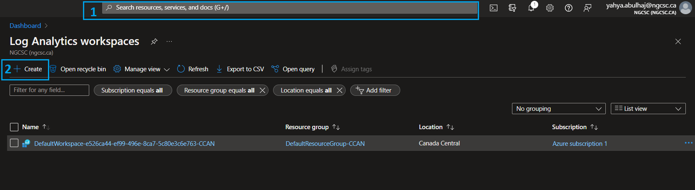

<br>

**1-** Specify the required subscription. <br>
**2-** Choose your resource group, or create a new one for all related senitnel resources. <br>
**3-** Name your workspace.<br>
**4/5-** Pick the region and click **Review + Create** <br>
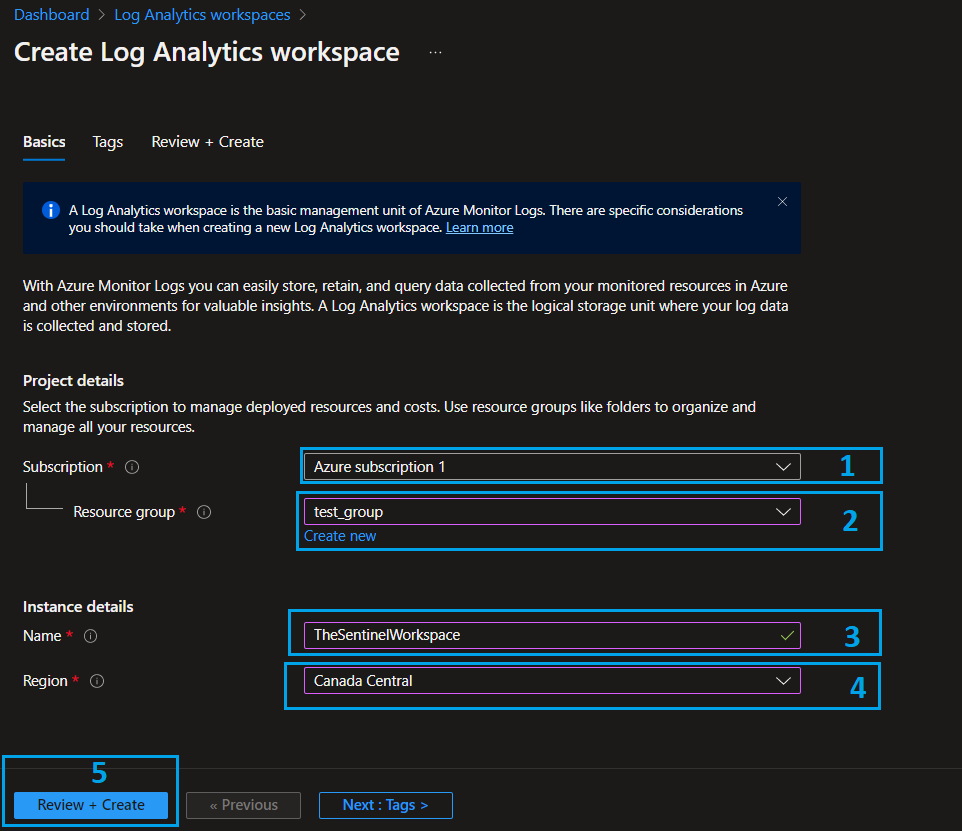

<br>

- Wait some seconds for the validation to pass and click **Create.**

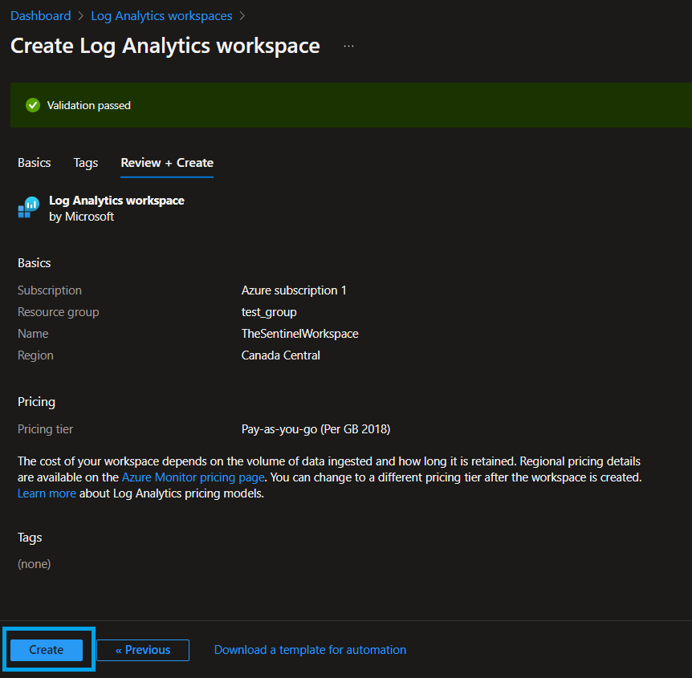

<br>

Once the creation is completed, you have to add sources to your workspace so that you can get data-in on Sentinel.

- In Log Analytics Workspace, go to Diagnostic Settings.
- Click Add **Diagnostic Setting**.
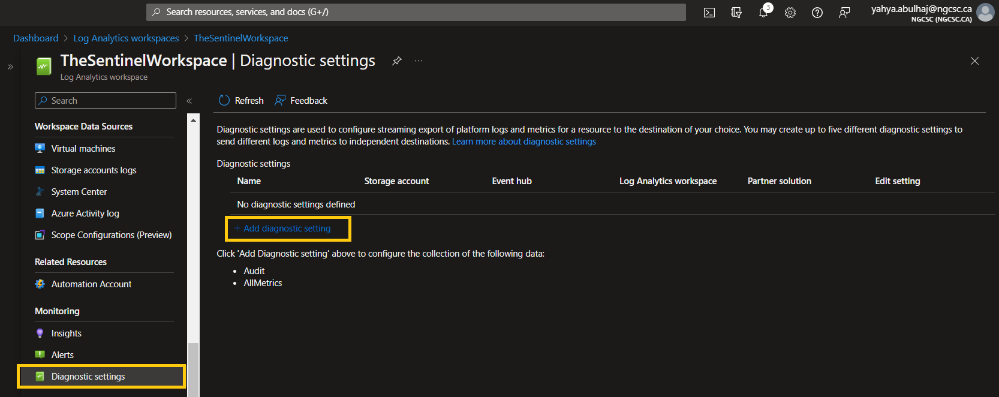

<br>

**1-** Specify the types of log you want to have access to.<br>
**2-** Send the logs to workspace you just created, you can consult the other options.<br>
**3-** Pick a name for the setting.<br>
**4-** Once finished, click **Save**
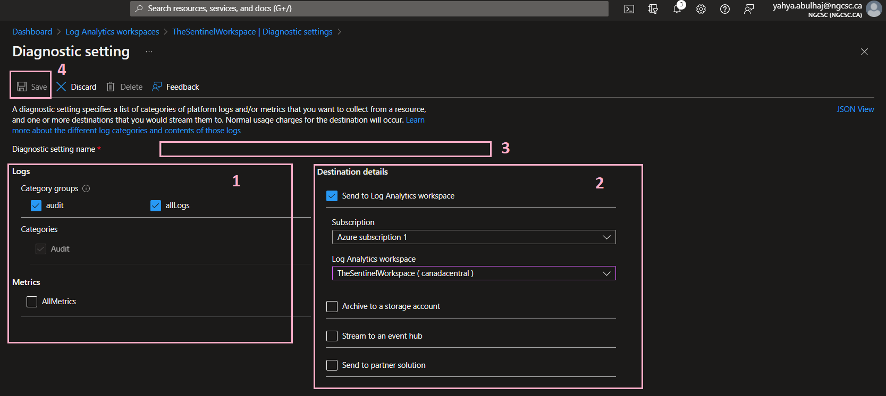

That's the required configuration for the **Log analytics workspace.**

# Create Microsoft Sentinel Instance
Once we have our workspace, we can go further and create Sentinel.

- Search bar in the portal, write Sentinel.
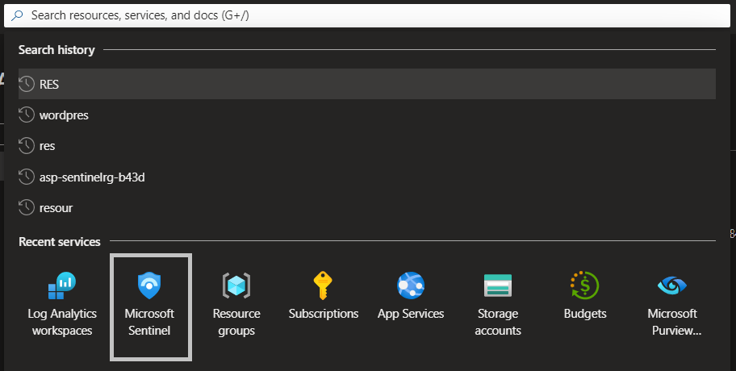

<br>

- Click **Create Microsoft Sentinel**.
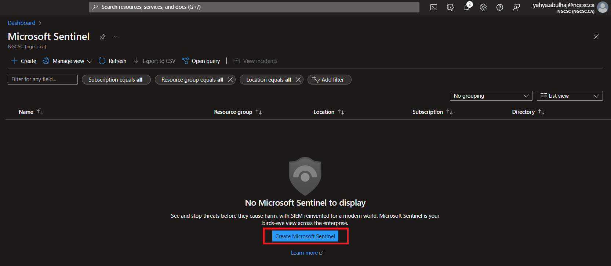

<br>

- Specify the workspace we just created and click **Add.**
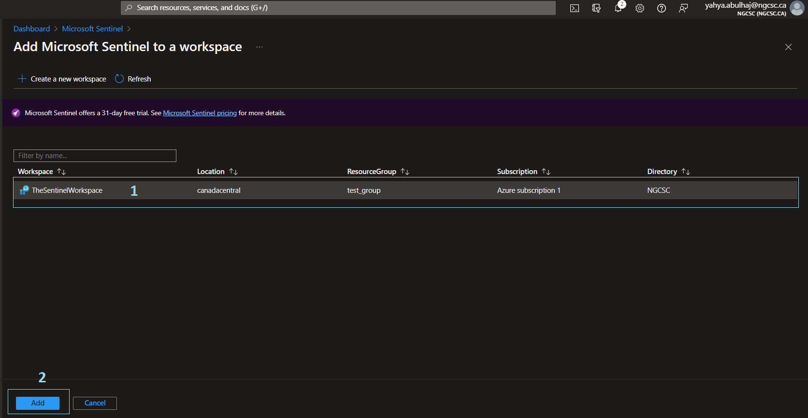

<br>

- Microsoft Sentinel is Setup.
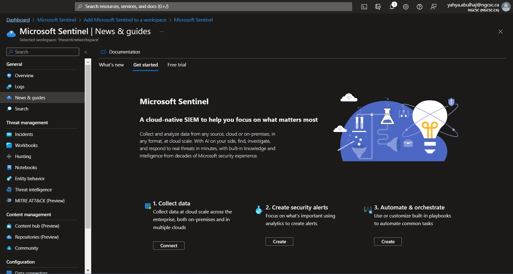

# Connectors
Once product is set, the first step is to import the necessary connectors before running any queries on Sentinel.

### Quickstart Connectors 
- Office
- Azure Activity
- Azure Active Directory

### Search for connectors

**1-** On the left pane, click Connectors

**2-** In the search bar, where you can search for the desired connector

**3-** Once found, give it a click and then open connector page

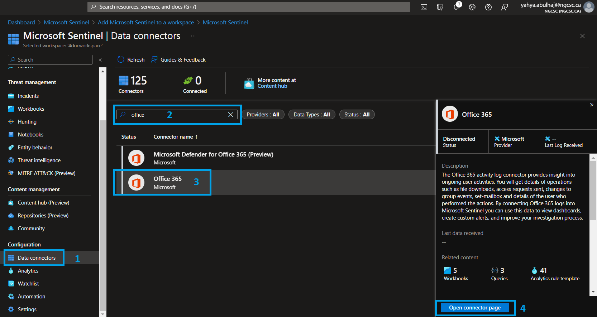


### The Connector page

**1-** The good news is once you ingest some connectors. There will be analytics rules, workbooks as well as queries applied within the connector bundle.

**2-** To be configured, each connector will need its own prerequisite.


**3-** The same is true for the configuration. However, here you can find configurations that are as simple as clicking and others that necessitate the use of APIs.


# Analytics Rules

The Microsoft Team is attempting to include as many Analytics rule templates as possible. However, it is nearly impossible to cover everything, so you should be aware of how to include built-in queries as well as create your own with some knowledge of KQL.


Here i'll go through both cases.

## Built-In Rules

You can select the template provided within the product from the asset below, and it should become active in a matter of seconds.

Once in Sentinel, Click Analytics => Rules Templates.


## Custom Analytics Rules
We'll walk through configuring the yaml file below, which includes all of the pipeline's parameters. 

However, for this demonstration, we will conduct it as a security operation.

Here is the YAML for Explicit MFA Deny. 


```yml
id: a22740ec-fc1e-4c91-8de6-c29c6450ad00
name: Explicit MFA Deny
description: |
  'User explicitly denies MFA push, indicating that login was not expected and the account's password may be compromised.'
severity: Medium
requiredDataConnectors:
  - connectorId: AzureActiveDirectory
    dataTypes:
      - SigninLogs
  - connectorId: AzureActiveDirectory
    dataTypes:
      - AADNonInteractiveUserSignInLogs
queryFrequency: 1d
queryPeriod: 1d
triggerOperator: gt
triggerThreshold: 0
status: Available
tactics:
  - CredentialAccess
relevantTechniques:
  - T1110
query: |
  let aadFunc = (tableName:string){
  table(tableName)
  | where ResultType == 500121
  | where Status has "MFA Denied; user declined the authentication" or Status has "MFA denied; Phone App Reported Fraud"
  | extend Type = Type
  | extend timestamp = TimeGenerated, AccountCustomEntity = UserPrincipalName, IPCustomEntity = IPAddress, URLCustomEntity = ClientAppUsed
  };
  let aadSignin = aadFunc("SigninLogs");
  let aadNonInt = aadFunc("AADNonInteractiveUserSignInLogs");
  union isfuzzy=true aadSignin, aadNonInt
entityMappings:
  - entityType: Account
    fieldMappings:
      - identifier: FullName
        columnName: AccountCustomEntity
  - entityType: IP
    fieldMappings:
      - identifier: Address
        columnName: IPCustomEntity
  - entityType: URL
    fieldMappings:
      - identifier: Url
        columnName: URLCustomEntity
version: 1.0.1
kind: Scheduled
```
 
This query will require **Azure Active Directory** connector for it to perform.

Go to Analytics but instead of templates, click **Create** then Scheduled query rule. 


As a best practice, refer to the pipeline and include a fit description so your team understands the role of this query.

Choose the severity indicated. And then choose your tactics. After that, click Next to set the rule.


**1-** As for the query, once it is created, enter it in this field and wait for the product to reload.

**2-** Don't forget about the Entity mapping.


Sentinel is constantly improving and incorporating artificial intelligence. When you include such queries, the product will be able to identify the correct entity and map it automatically.

This is extremely powerful as it allows you to not only find out what’s going on in your environment but also to perform SecOps quick.

Once Entities are set click Next to incidents Settings.


**1-** What is most important here is to **enable incident creation** so that you can be notified via your product home page if any threats are triggering.

**2-** The second section is to organize your queries. This is helpful when you have tons of rules that make sense as groups. I'll leave the decision to you.


**1-** You can receive an automated response that will take you to a logic app where you can decide what action to take when this rule is triggered.

In this case, I prefer sending an email to my manager about an analytics with a high severity and posting the threat to our team channel.

**2-** When you're finished, you'll see a summary of the entire rule. Continue with the creation by clicking **Create.**


# Workbooks

## Built-In Workbooks

Microsoft provides a set of templates along the chosen connector that you can take advantage of directly and use.

**1-** On the left pane, Click **Workbooks.**

**2-** Click **Templates**.

**3-** Search for the desired workbook.

**4-** Click **save**, click to My workbooks besides the template and you should have it.

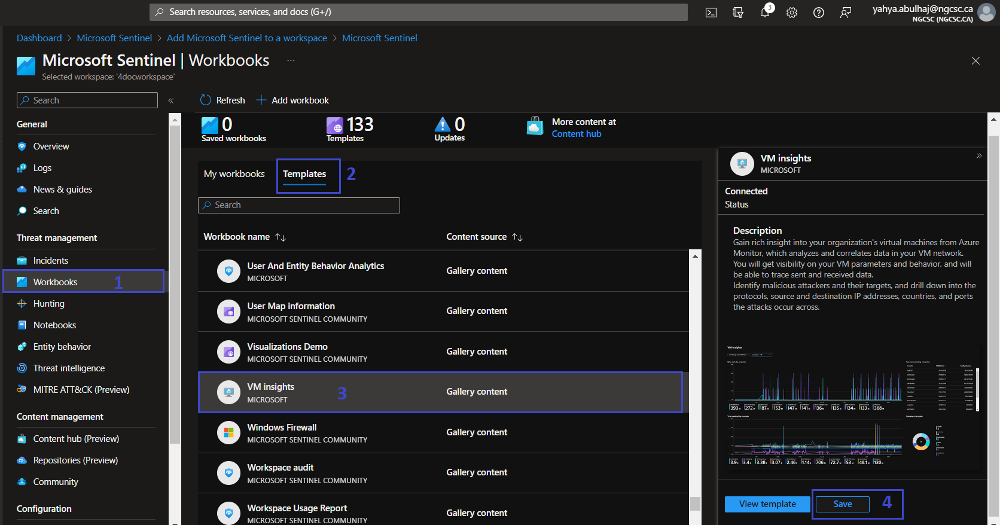


## Custom Workbooks
In addition to the templates, you can make your own. **JSON** and **ARM Templates** formats are supported by workbooks.

1- Go to **Workbooks**

2- Instead of Templates, Click **Add Workbook**

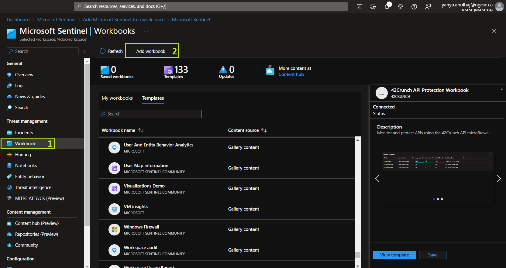

<br>

Click on **Edit**

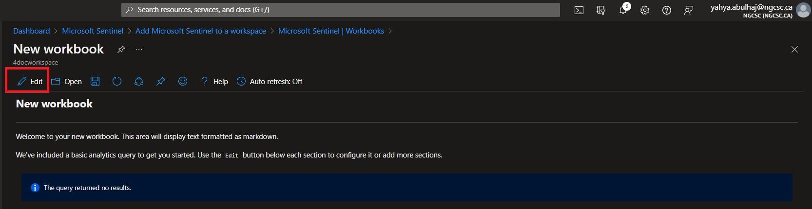

<br>

**1-** Click on the **code <>**  <br>

**2-** This will print you the editor where you can decide the type.     
- For this demo we will use JSON, copy my [workbook](https://github.com/Azure/Azure-Sentinel/blob/master/Workbooks/SentinelCosts.json) and paste it on your environment.

**3-** Once done, click **Apply**   <br>

**4-** Click **Done Editing** 

**5-** Then, the **Save Icon**.

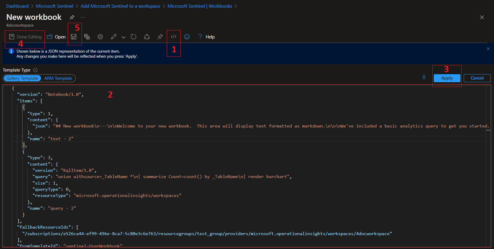

Continue by entering the name of your workbook, the subscription, the RG, and the location.

Finally Click **Apply**
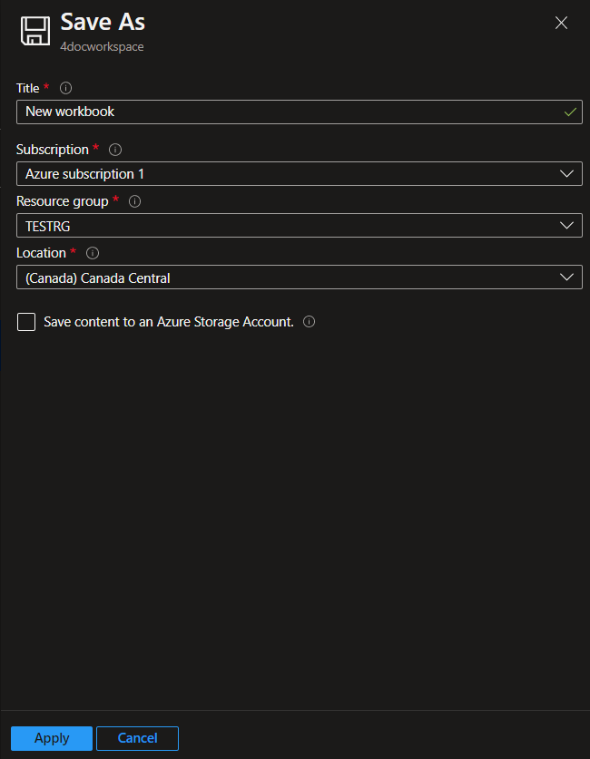


That's how it's done. You can keep looking through the Microsoft repo for open source workbooks.

# Workbook Showcase

This section is where you can marvel at the fantastic insights generated by this feature.

## Azure Activity
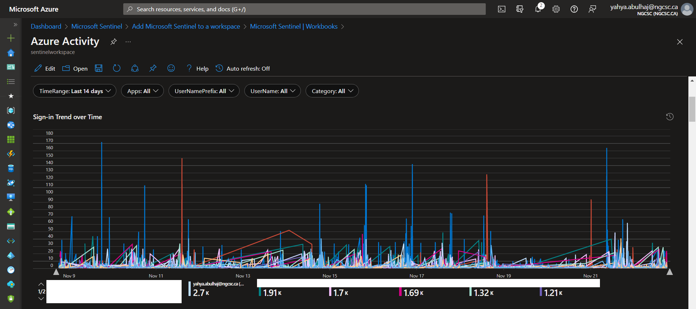

<br>

## Azure Active Directory Audit Insights
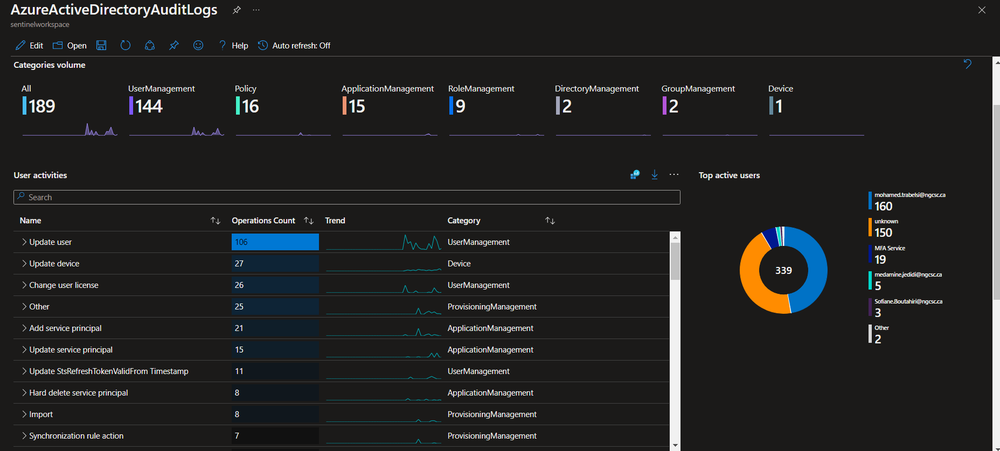

<br>

## All In One Insights
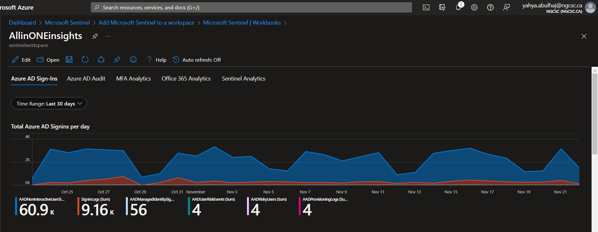

<br>

## Multi-Factor Authentification Insights

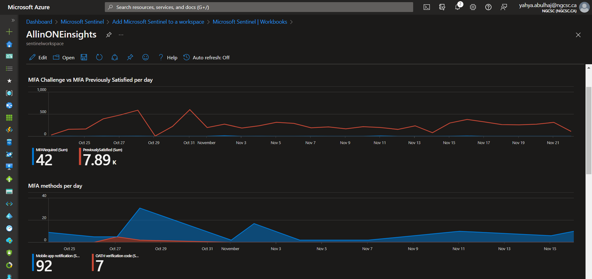

<br>

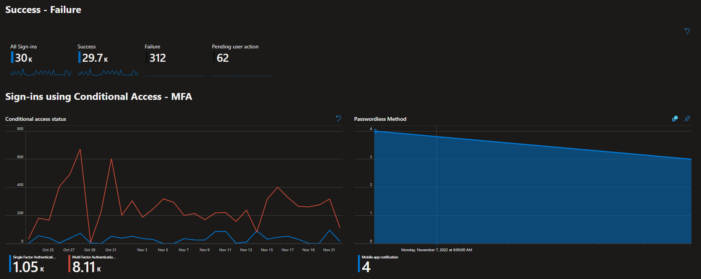

<br>

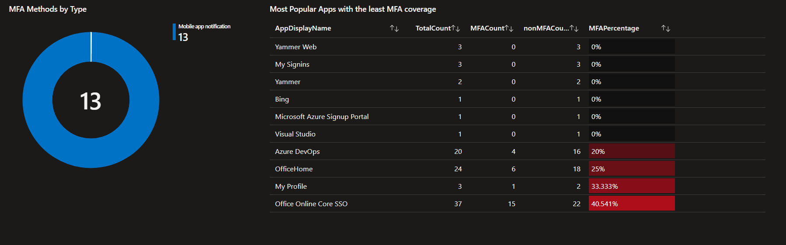

<br>

## Conditionnal Access Insights
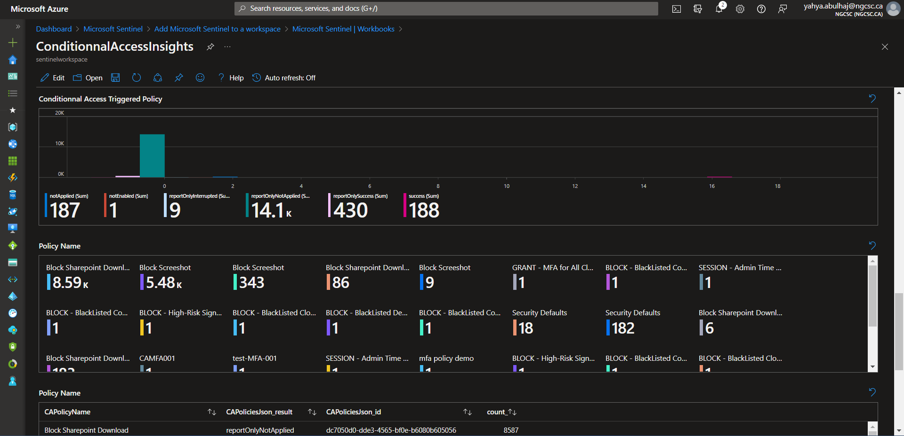

## Closure
That's it; your connectors and analytics should now be properly preconfigured. You also can add workbooks and create your own.


